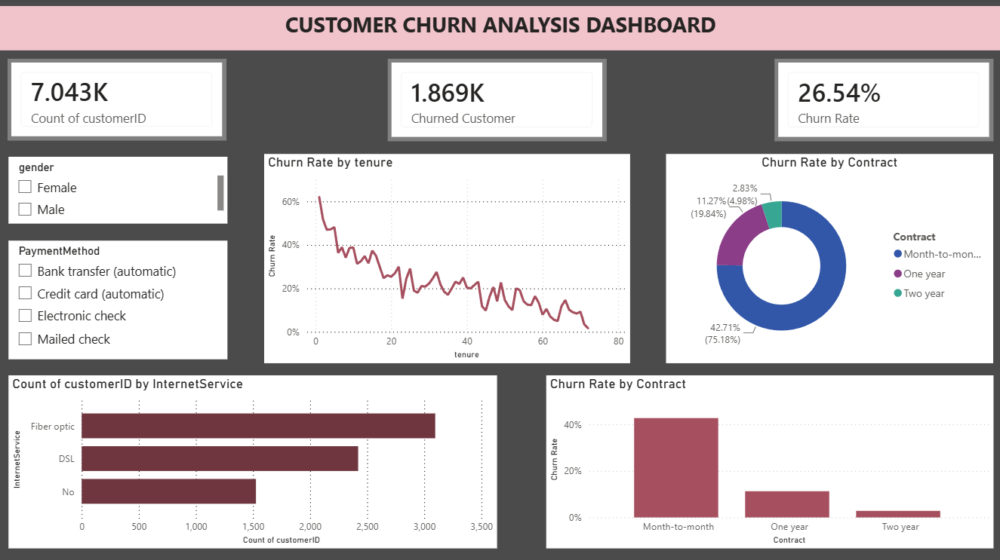

# 📊 Customer_Churn_Analysis

## 🔍 Overview
This project analyzes customer churn using Power BI.

## 📌 Key Metrics
- Total Customers
- Churned Customers
- Churn Rate

## 📊 Visuals Used
- Line Chart (Tenure vs Customers)
- Pie Chart (Contract Type)
- Bar Chart (Internet Service)
- Slicers (Gender, Payment Method)

## 💡 Insights
- Customers with low tenure have higher churn
- Month-to-month contracts have more churn
- Certain payment methods show higher churn

## 🛠 Tools Used
- Power BI
- Excel

## 📷 Dashboard Preview

